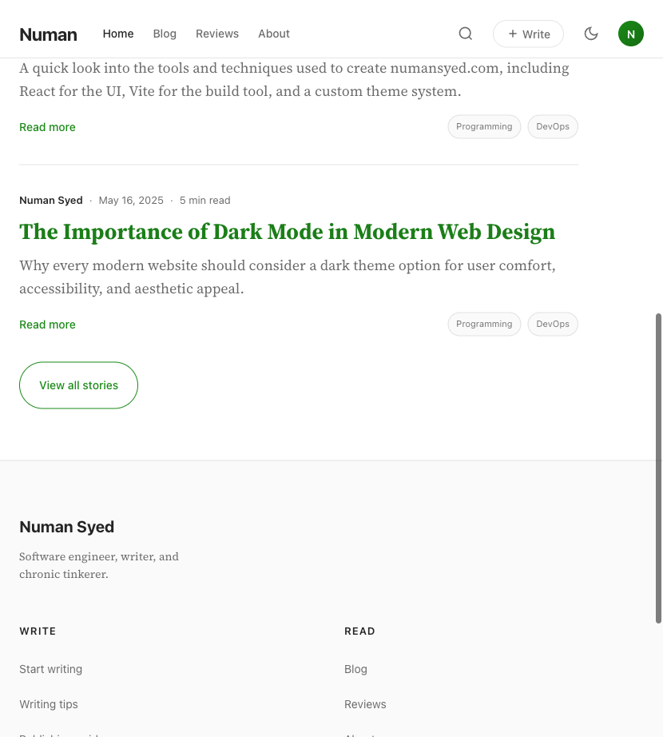
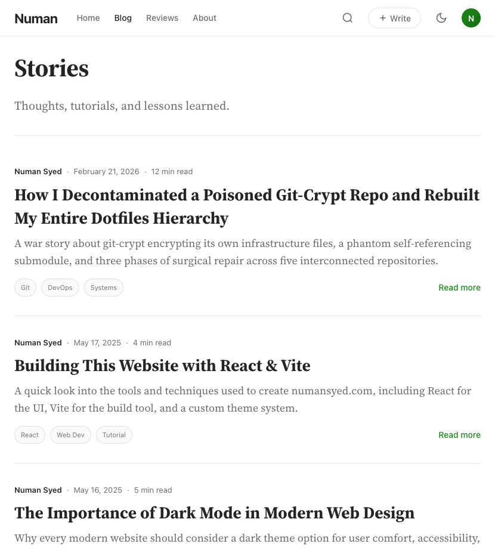
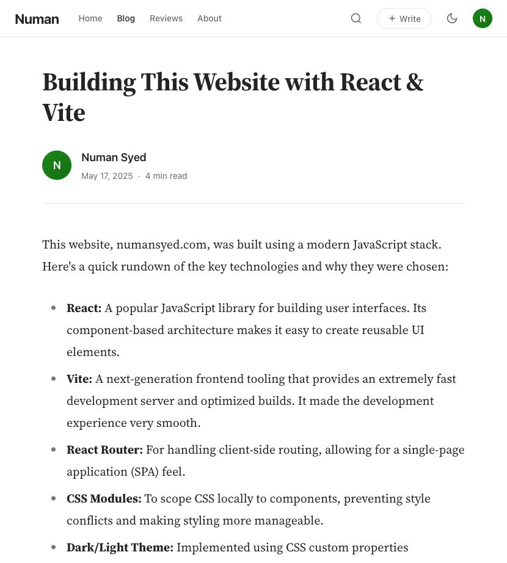

# numansyed.com

A personal blog and portfolio website inspired by Medium.com's clean, minimalist design aesthetics.

## Features

- Medium-inspired reading experience with clean typography
- Dark/Light theme support
- Blog posts with reading time estimates
- Responsive design for all devices
- Author bio sections
- Topic-based content organization

## Tech Stack

- **Frontend**: React 18 + Vite
- **Routing**: React Router DOM
- **Styling**: CSS Modules
- **Fonts**: Source Serif 4 (headings), Inter (UI)
- **Deployment**: GitHub Pages / Cloudflare Pages

## Getting Started

### Prerequisites

- Node.js 18+
- npm

### Installation

```bash
npm install
```

### Development

```bash
npm run dev
```

### Build

```bash
npm run build
```

### Preview Production Build

```bash
npm run preview
```

## Project Structure

```
src/
├── components/
│   ├── Layout/
│   │   ├── Header.jsx
│   │   ├── Footer.jsx
│   │   └── Layout.jsx
│   └── ui/
├── pages/
│   ├── HomePage/
│   ├── BlogPage/
│   ├── BlogPostPage/
│   └── ReviewsPage/
├── styles/
│   └── design-tokens.css
├── App.jsx
├── main.jsx
└── index.css
```

## Screenshots

### Homepage


### Blog Page


### Blog Post


## Deployment

The site automatically deploys to [numansyed.com](https://numansyed.com) when changes are pushed to the `main` branch.

### Manual Deployment

```bash
npm run build
# Deploy the dist/ folder to GitHub Pages or Cloudflare Pages
```

## Revert Branch

A revert branch `pre-medium-style-redesign` exists for rolling back the Medium-style redesign if needed.

## Remaining Work

See [PENDING-UPDATES.md](./PENDING-UPDATES.md) for a list of incomplete features and known issues.

## License

MIT
