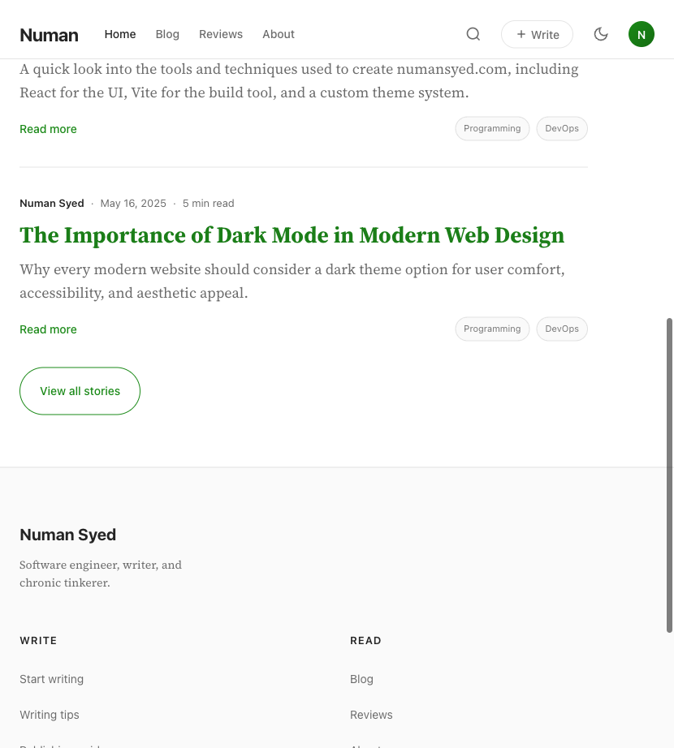
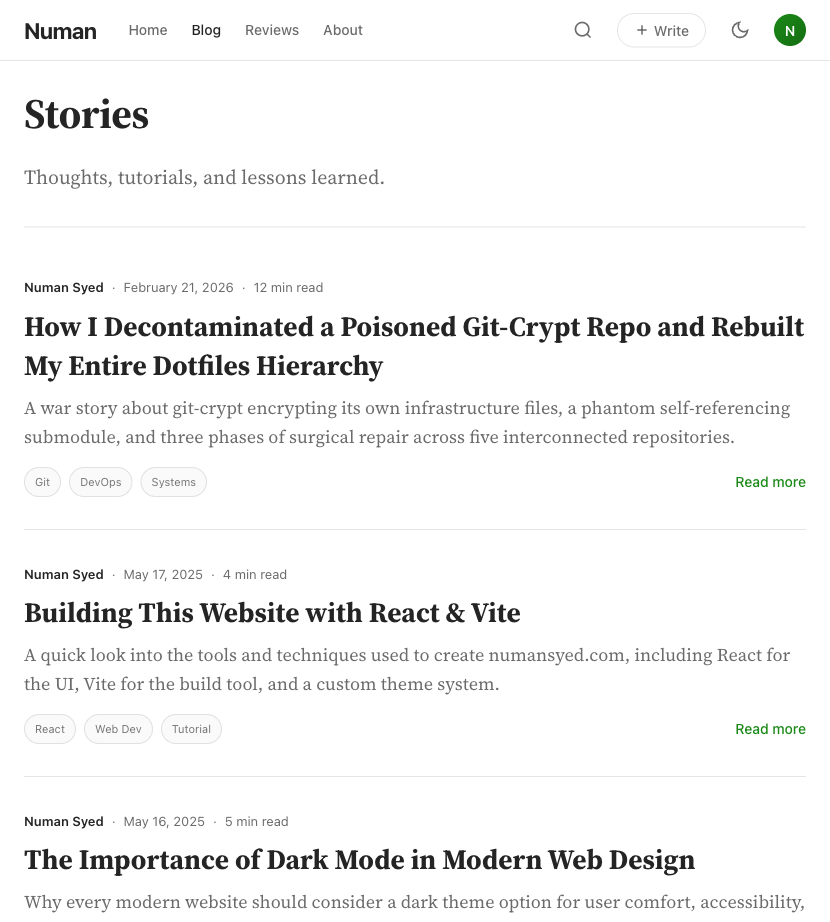
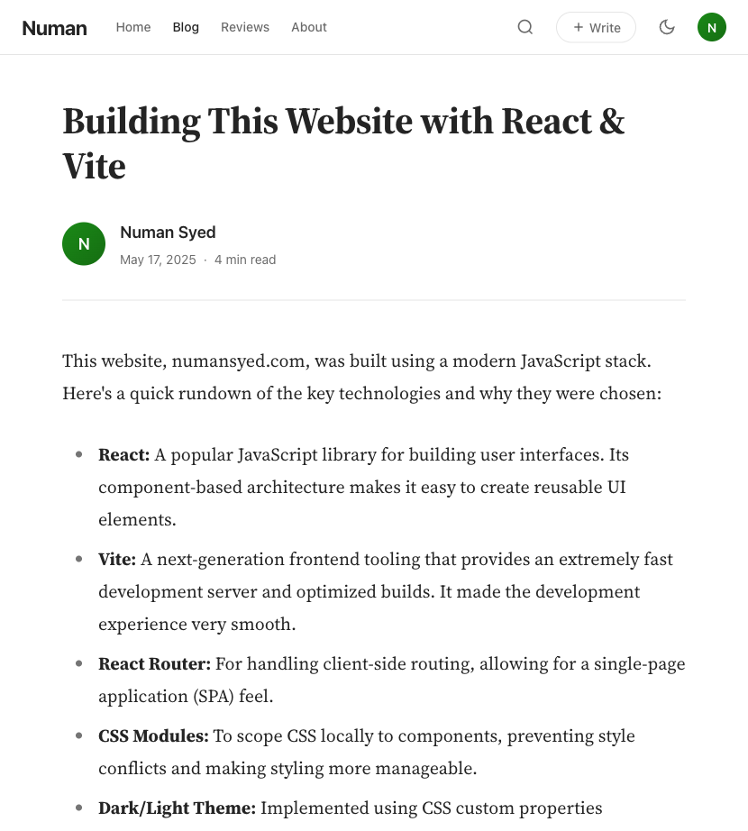

# numansyed.com

A personal blog and portfolio website inspired by Medium.com's clean, minimalist design aesthetics.

## Features

- Medium-inspired reading experience with clean typography
- Dark/Light theme support
- Blog posts with reading time estimates
- **Digital Garden** — evolving notes with maturity stages (seedling/budding/evergreen), connected notes, and topic filtering
- **Today I Learned (TIL)** — bite-sized daily learning entries with inline code rendering and topic filtering
- Fuzzy search across titles, excerpts, content, and tags
- Clickable topic tags with filtering across all sections
- Responsive design for all devices
- Author bio sections

## Tech Stack

- **Frontend**: React 18 + Vite
- **Routing**: React Router DOM
- **Styling**: CSS Modules
- **Fonts**: Source Serif 4 (headings), Inter (UI)
- **Deployment**: GitHub Pages / Cloudflare Pages

## Getting Started

### Prerequisites

- Node.js 18+
- npm

### Installation

```bash
npm install
```

### Development

```bash
npm run dev
```

### Build

```bash
npm run build
```

### Preview Production Build

```bash
npm run preview
```

## Project Structure

```
src/
├── components/
│   └── Layout/
│       ├── Header.jsx
│       └── Footer.jsx
├── data/
│   ├── blogPosts.js
│   ├── gardenNotes.js
│   └── tilEntries.js
├── pages/
│   ├── HomePage/
│   ├── BlogPage/
│   ├── BlogPostPage/
│   ├── GardenPage/
│   ├── GardenNotePage/
│   ├── TILPage/
│   ├── ReviewsPage/
│   ├── AboutPage/
│   └── NotFoundPage/
├── App.jsx
├── main.jsx
└── index.css
```

## Screenshots

### Homepage


### Blog Page


### Blog Post


## Deployment

The site automatically deploys to [numansyed.com](https://numansyed.com) when changes are pushed to the `main` branch.

### Manual Deployment

```bash
npm run build
# Deploy the dist/ folder to GitHub Pages or Cloudflare Pages
```

## Revert Branch

A revert branch `pre-medium-style-redesign` exists for rolling back the Medium-style redesign if needed.

## Changelog

### 2026-03-12 — Digital Garden & TIL
- Added Digital Garden section (`/garden`) with card grid, maturity status badges, and dual filtering (status + topic)
- Added Garden Note detail pages (`/garden/:slug`) with connected notes, maturity indicators, and reading layout
- Added Today I Learned section (`/til`) with reverse-chronological entries, inline code rendering, and topic filtering
- Updated homepage with "From the Garden" and "Recently Learned" preview sections
- Updated header and footer navigation with new section links

### 2026-02 — Search & Tags
- Inline expandable fuzzy search in header (PR #6, #7)
- Clickable tags across all pages with topic filtering via `/blog?topic=X`
- Search covers titles, excerpts, content, and tags

### 2026-02 — Medium-Style Redesign
- Complete visual redesign inspired by Medium.com (PR #5)
- Two-tone "Numan Syed" logo, hero section, post cards
- Blog page with sidebar (popular posts, topic discovery)
- Blog post page with author block, reading time, author card
- Rich footer with section links
- Dark/Light theme with CSS custom properties

## Remaining Work

See [PENDING-UPDATES.md](./PENDING-UPDATES.md) for a list of incomplete features and known issues.

## License

MIT
